# 有給休暇管理アプリ

> [!IMPORTANT]
> このアプリは学習・検証・ポートフォリオ用のプロトタイプです。  
> localStorageにデータを保存しており、パスワードも平文で扱っています。  
> 本番運用には使用しないでください。

> [!WARNING]
> このリポジトリにはデモ用の固定ログイン情報が含まれています。  
> 実在の社員情報・会社情報・機密情報は含めないでください。

HTML / CSS / JavaScript / localStorage で作成した、有給休暇管理アプリのMVPです。

管理者は社員ごとの有給付与・取得・残日数を管理でき、社員は自分の有給残日数や取得履歴を確認できます。

---

## デモ

https://satochan-ai.github.io/paid-leave-app/

---

## デモ用途について

このアプリは**学習・検証・ポートフォリオ用のプロトタイプ**です。  
localStorageを使用しているため、本番運用には適していません。

---

## スクリーンショット

### ログイン画面

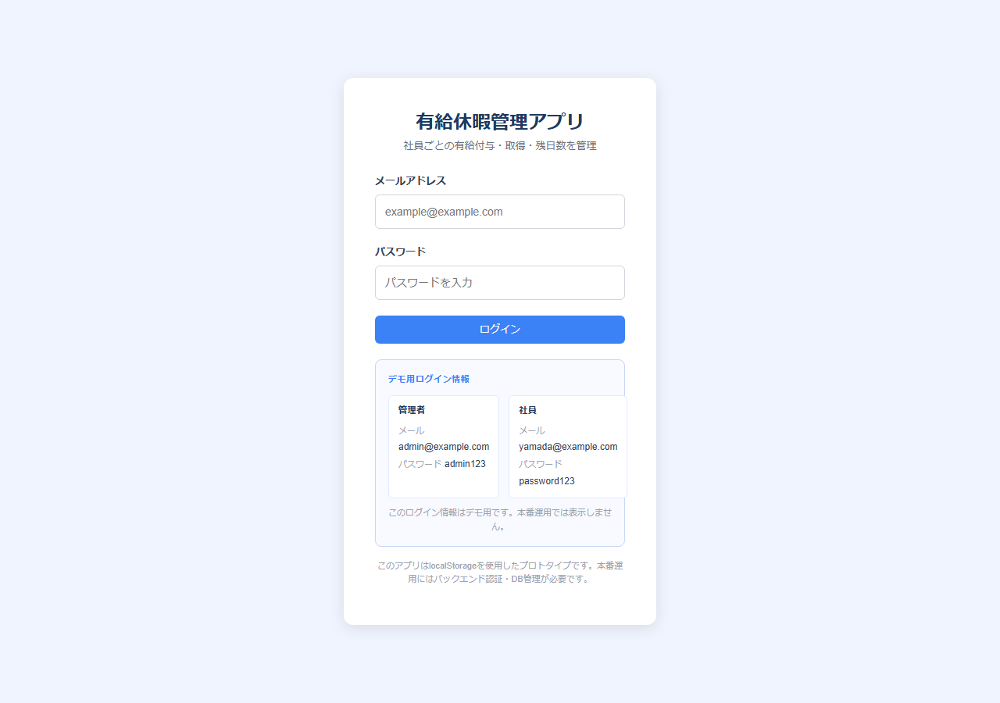

### 管理者ダッシュボード

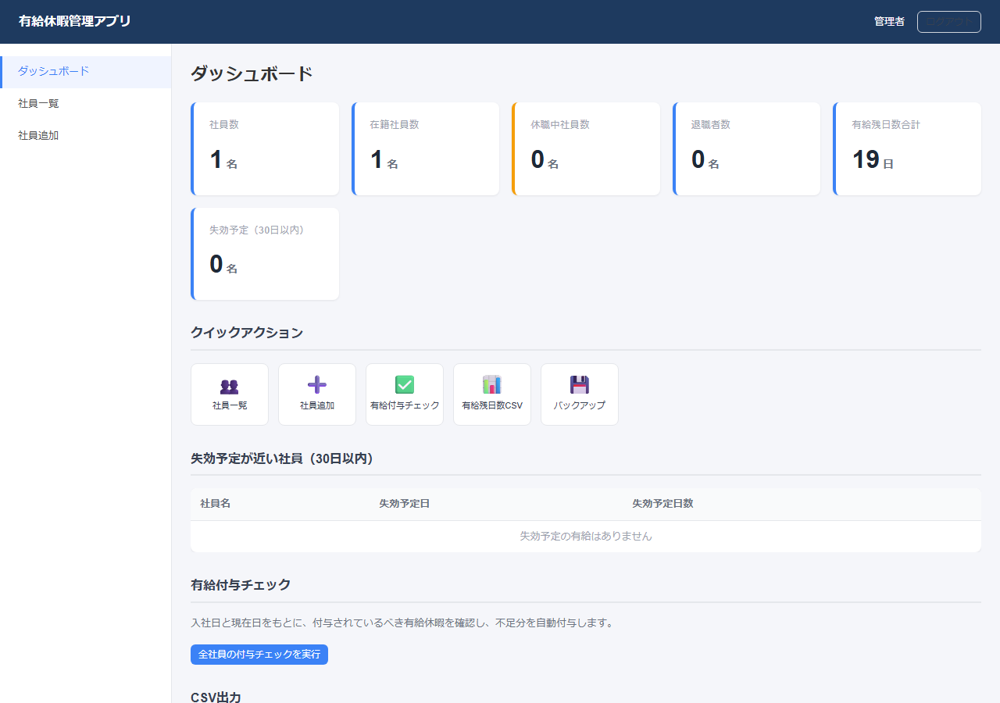

### 社員一覧（通常付与・比例付与バッジ表示）

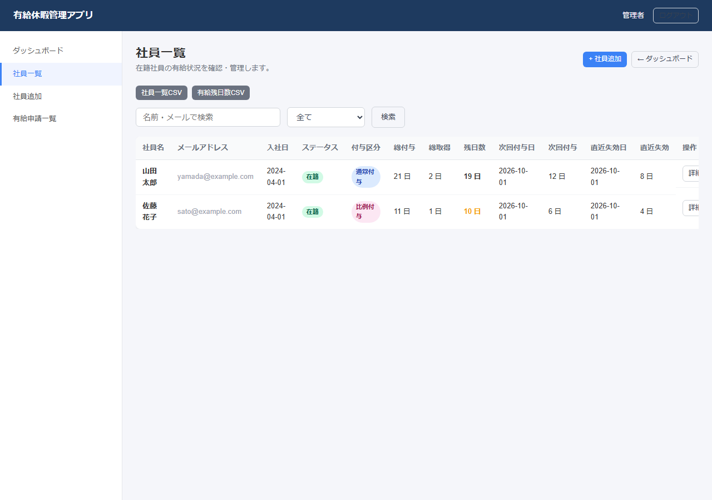

### 社員詳細

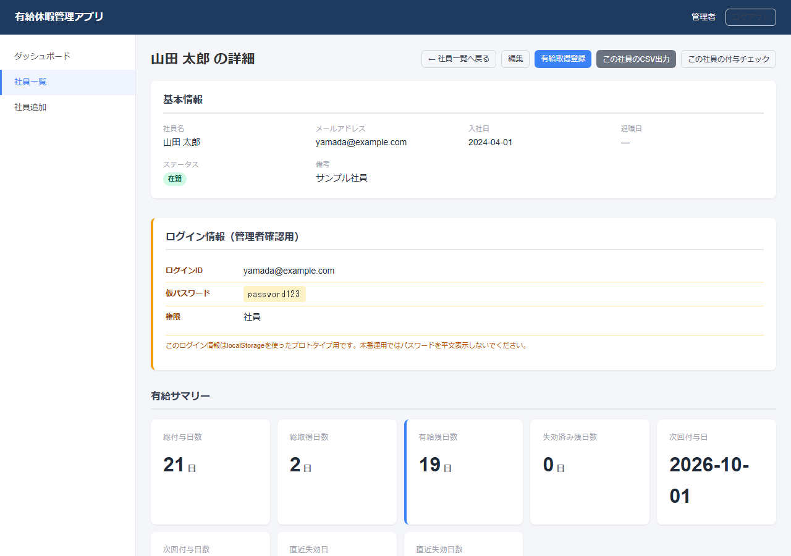

### 比例付与社員詳細

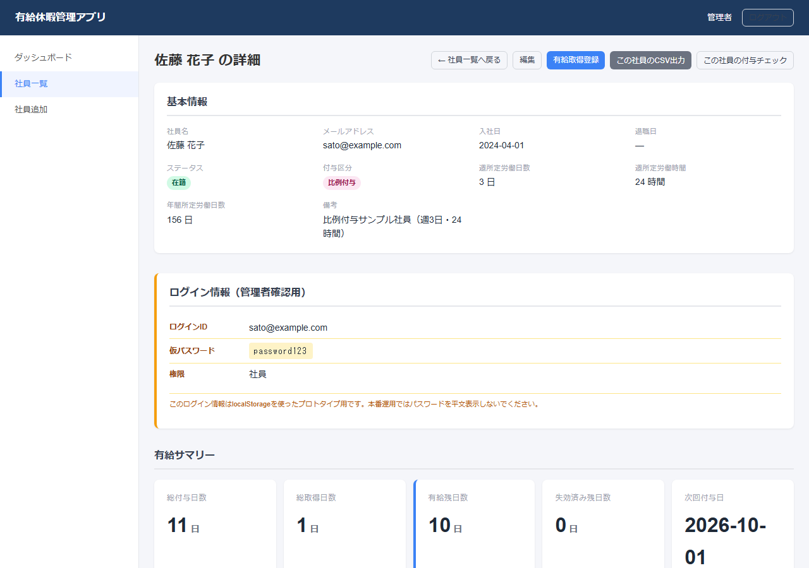

### 社員マイページ（勤務条件表示）

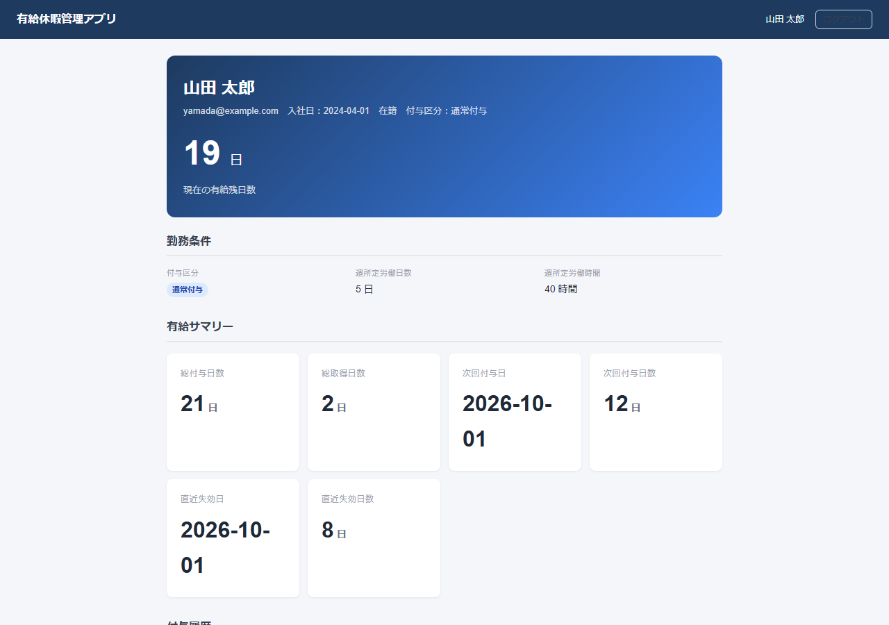

### 有給申請フォーム

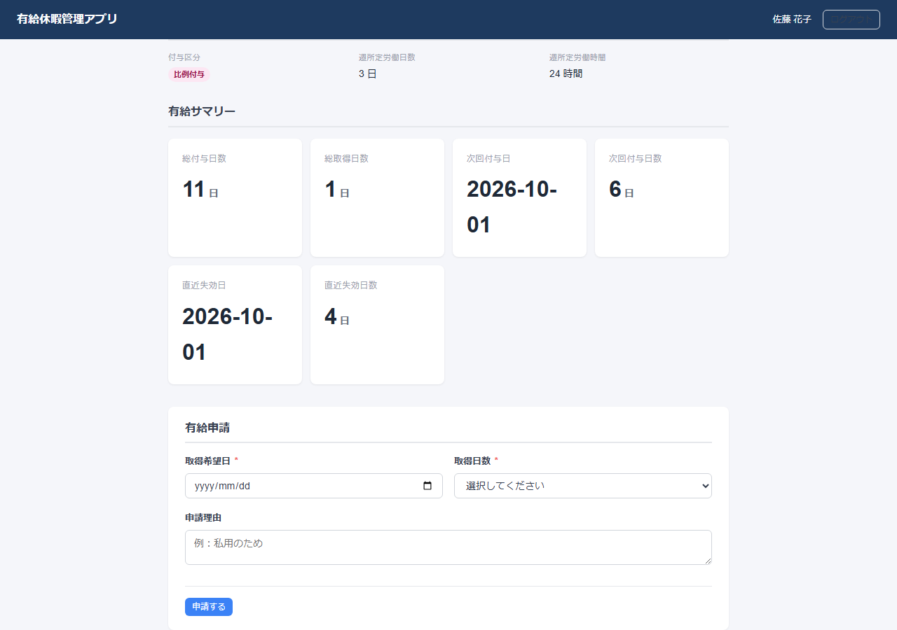

### 管理者：有給申請一覧

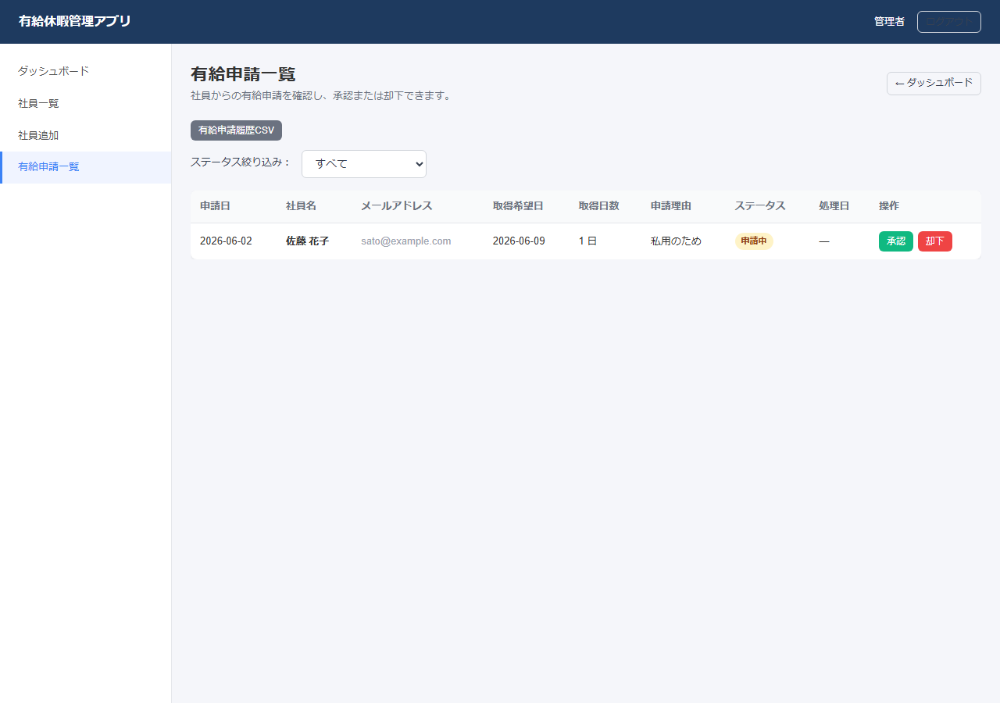

### 承認済み申請

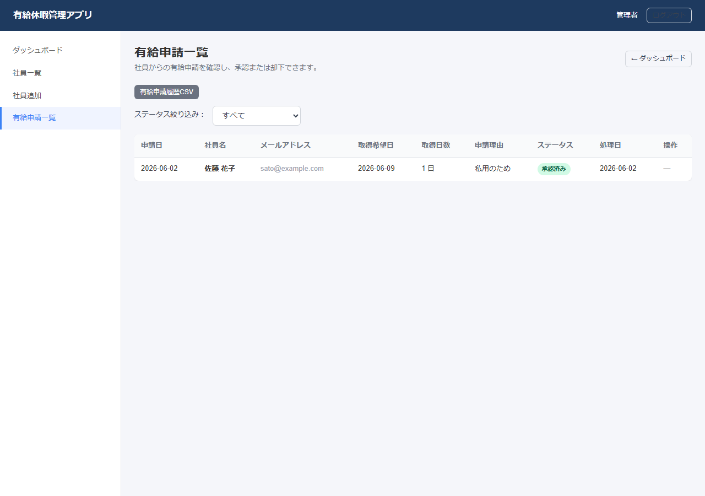

### 申請中の取消ボタン

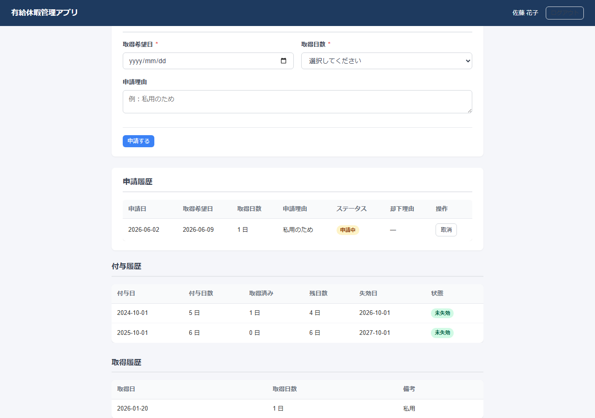

### 取消済み申請

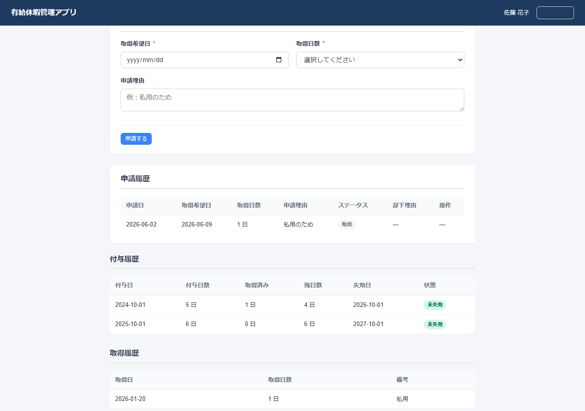

---

## 主な機能

### 管理者機能

- ログイン
- ダッシュボード（KPI・失効予定アラート・クイックアクション・未承認申請数）
- 社員一覧（検索・ステータス絞り込み）
- 社員追加・編集
- 社員詳細（仮ログイン情報確認）
- 有給取得登録（1日・半休0.5日）
- **有給申請一覧（申請確認・承認・却下）**
- 有給付与チェック（付与漏れ自動検出・補完）
- CSV出力（社員一覧・有給残日数・取得履歴・社員別詳細・**有給申請履歴**）
- JSONバックアップ・復元
- デモデータ初期化

### 社員機能

- ログイン
- マイページ（有給残日数・次回付与日・直近失効日・履歴）
- **有給申請（取得希望日・取得日数・理由を入力）**
- **申請履歴（ステータス・却下理由の確認）**

---

## 対応している有給ルール

- 入社6か月後に付与（通常付与：10日 / 比例付与：1〜7日）
- 以降、法定付与日数に従って付与
- 付与日から2年で失効
- 有給取得時は古い付与分から消化
- 半休0.5日に対応

### 法定付与日数（通常付与）

| 継続勤務年数 | 付与日数 |
|---:|---:|
| 0.5年 | 10日 |
| 1.5年 | 11日 |
| 2.5年 | 12日 |
| 3.5年 | 14日 |
| 4.5年 | 16日 |
| 5.5年 | 18日 |
| 6.5年以上 | 20日 |

---

## 有給申請・承認フロー

社員はマイページから有給申請を行い、管理者は申請一覧から承認・却下できます。

### 流れ

1. 社員がマイページから有給申請（取得希望日・日数・理由を入力）
2. 申請時点では有給残日数は減らない
3. 管理者が有給申請一覧で確認
4. 管理者が承認すると有給取得履歴へ反映
5. 承認時に有給残日数が減る
6. 却下した場合は却下理由が保存される

### 対応内容

- 1日単位・半休0.5日の申請
- 申請中 / 承認済み / 却下 のステータス管理
- 重複申請防止（同一日付・同一社員に pending/approved がある場合は申請不可）
- 残日数不足チェック

### 有給申請フォーム


### 管理者：有給申請一覧


### 承認済み申請


---

## 有給申請の取消

社員は、管理者が承認・却下する前の「申請中」の有給申請を取り消すことができます。

### 仕様

- 取消できるのは申請中のみ
- 承認済み・却下済みは取消不可
- 取消済み申請は履歴として残る
- 取消時に有給残日数は変わらない
- 有給申請履歴CSVにも取消者ID・取消日時が出力される

### 申請中の取消ボタン


### 取消済み申請


---

### 比例付与対応（Round19追加）

週所定労働日数が少ない労働者についても、比例付与テーブルに基づいて有給付与日数を自動計算できます。

**通常付与になる条件（いずれか1つ以上）**
- 週所定労働時間 30時間以上
- 週所定労働日数 5日以上
- 年間所定労働日数 217日以上

**比例付与テーブル**

| 週所定労働日数 | 0.5年 | 1.5年 | 2.5年 | 3.5年 | 4.5年 | 5.5年 | 6.5年以上 |
|---:|---:|---:|---:|---:|---:|---:|---:|
| 4日 | 7 | 8 | 9 | 10 | 12 | 13 | 15 |
| 3日 | 5 | 6 | 6 | 8 | 9 | 10 | 11 |
| 2日 | 3 | 4 | 4 | 5 | 6 | 6 | 7 |
| 1日 | 1 | 2 | 2 | 2 | 3 | 3 | 3 |

**例：週3日勤務（週24時間・年間156日）**
- 入社0.5年：5日
- 入社1.5年：6日
- 入社2.5年：6日

---

## 技術構成

| 項目 | 内容 |
|------|------|
| フロントエンド | HTML / CSS / JavaScript（バニラ） |
| データ保存 | localStorage |
| 認証 | localStorageを使った簡易認証 |
| バックエンド | なし |

---

## 起動方法

### 推奨：ローカルサーバーで起動

`file://` で直接開くとログインできない場合があります。必ずローカルサーバーで起動してください。

**Pythonの場合**

```bash
cd paid-leave-app
python -m http.server 8080
```

ブラウザで `http://localhost:8080` を開きます。

**VS Code Live Serverの場合**

`index.html` を右クリック → 「Open with Live Server」

詳細は [`docs/local_setup_guide.md`](docs/local_setup_guide.md) を参照してください。

---

## スクリーンショット撮影

このリポジトリには、Playwright を使ったスクリーンショット自動撮影スクリプトを用意しています。  
外部サーバーの起動は不要です。`npm run screenshots` だけで完結します。

### 事前準備

```bash
npm install
```

### 撮影実行

```bash
npm run screenshots
```

撮影された画像は `docs/images/` に保存されます。

> **注意：** `node_modules/` は `.gitignore` により Git 管理対象外です。  
> `docs/images/*.png` は README 表示に使うため Git 管理対象です。

---

## 初期ログイン情報

### 管理者

| 項目 | 値 |
|------|---|
| メールアドレス | admin@example.com |
| パスワード | admin123 |

### 社員（通常付与サンプル）

| 項目 | 値 |
|------|---|
| メールアドレス | yamada@example.com |
| パスワード | password123 |

### 社員（比例付与サンプル）

| 項目 | 値 |
|------|---|
| メールアドレス | sato@example.com |
| パスワード | password123 |

> これらはデモ用の固定ログイン情報です。

---

## 注意事項

このアプリはプロトタイプです。

- パスワードはlocalStorageに**平文保存**されています
- 社員詳細画面に**仮パスワードを表示**しています（プロトタイプ用仕様）
- 本番利用には**バックエンド認証が必要**です
- データはブラウザ単位で保存され、**端末やブラウザをまたいでの共有はできません**

詳細は [`docs/security_notes.md`](docs/security_notes.md) を参照してください。

---

## 未実装機能

以下の機能は現在実装されていません。

- メール通知（失効予定アラート・申請通知など）
- 本番認証（JWTなど）
- サーバーDB保存
- 出勤率8割判定
- 休職期間を考慮した厳密な付与判定
- CSVインポート

## 本番化する場合の改善案

- Supabase / Firebase などへの移行（`storage.js` を差し替えるだけで対応可能な設計）
- パスワードハッシュ化
- 初回ログイン時のパスワード変更
- 有給申請承認フロー
- メール通知
- 出勤率8割判定

詳細は [`docs/future_roadmap.md`](docs/future_roadmap.md) を参照してください。

---

## フォルダ構成

```
paid-leave-app/
│
├── index.html              # ログイン画面
├── README.md
│
├── assets/
│   ├── css/
│   │   ├── base.css        # 基本スタイル
│   │   ├── layout.css      # レイアウト（ヘッダー・サイドバー）
│   │   ├── components.css  # 共通部品（ボタン・テーブル・カード）
│   │   ├── pages.css       # 画面固有スタイル
│   │   └── responsive.css  # レスポンシブ対応
│   │
│   └── js/
│       ├── app.js              # アプリ全体の初期化・描画
│       ├── auth.js             # 認証処理
│       ├── storage.js          # localStorage操作（移行時はここを差し替える）
│       ├── seed.js             # 初期データ投入
│       ├── utils.js            # 共通ユーティリティ
│       ├── leaveCalculator.js  # 有給計算ロジック
│       ├── leaveService.js     # 有給データ操作
│       ├── employeeService.js  # 社員データ操作
│       ├── validation.js       # 入力バリデーション
│       ├── routerGuard.js      # アクセス制御
│       ├── csvService.js       # CSV出力
│       └── backupService.js    # JSONバックアップ/復元
│
├── pages/
│   ├── admin/
│   │   ├── dashboard.html       # 管理者ダッシュボード
│   │   ├── employees.html       # 社員一覧
│   │   ├── employee-form.html   # 社員追加・編集
│   │   ├── employee-detail.html # 社員詳細
│   │   └── leave-usage-form.html # 有給取得登録
│   │
│   └── employee/
│       └── mypage.html          # 社員マイページ
│
└── docs/                        # 仕様書・運用資料（18ファイル）
```

---

## ポートフォリオ説明資料

以下の資料を `docs/` 配下に整理しています。

| ファイル | 用途 |
|---------|------|
| [`docs/portfolio_summary.md`](docs/portfolio_summary.md) | ポートフォリオ・GitHubに掲載する概要 |
| [`docs/presentation_outline.md`](docs/presentation_outline.md) | 社内説明・面談時の説明構成 |
| [`docs/screenshot_checklist.md`](docs/screenshot_checklist.md) | スクリーンショット撮影チェックリスト |
| [`docs/demo_talk_script.md`](docs/demo_talk_script.md) | デモ時の台本（管理者・社員・QA対応） |
| [`docs/demo_scenario.md`](docs/demo_scenario.md) | デモ手順書 |

---

## ドキュメント一覧

| ファイル | 内容 |
|---------|------|
| [`docs/requirements.md`](docs/requirements.md) | 要件定義書 |
| [`docs/screen_design.md`](docs/screen_design.md) | 画面設計書 |
| [`docs/data_model.md`](docs/data_model.md) | データ設計書 |
| [`docs/logic_spec.md`](docs/logic_spec.md) | 有給計算ロジック仕様書 |
| [`docs/security_notes.md`](docs/security_notes.md) | セキュリティ注意事項 |
| [`docs/csv_export_spec.md`](docs/csv_export_spec.md) | CSV出力仕様書 |
| [`docs/backup_restore_spec.md`](docs/backup_restore_spec.md) | バックアップ/復元仕様書 |
| [`docs/leave_grant_check_spec.md`](docs/leave_grant_check_spec.md) | 有給付与チェック仕様書 |
| [`docs/local_setup_guide.md`](docs/local_setup_guide.md) | ローカル起動ガイド |
| [`docs/operation_checklist.md`](docs/operation_checklist.md) | 動作確認チェックリスト |
| [`docs/github_publish_checklist.md`](docs/github_publish_checklist.md) | GitHub公開前チェックリスト |
| [`docs/release_notes.md`](docs/release_notes.md) | リリースノート（Round別開発履歴） |
| [`docs/known_limitations.md`](docs/known_limitations.md) | 既知の制限事項 |
| [`docs/future_roadmap.md`](docs/future_roadmap.md) | 今後の拡張予定 |
| [`docs/final_qa_report.md`](docs/final_qa_report.md) | 最終QAレポート |
| [`docs/round6_mvp_summary.md`](docs/round6_mvp_summary.md) | MVP完成サマリー |

---

## 今後の拡張予定

- 有給申請ワークフロー（社員が申請→管理者が承認）
- 出勤率8割判定
- メール通知（失効予定アラート）
- バックエンド移行（Supabase / Firebase / GAS / PHP / Node.js）
- パスワードハッシュ化
- 帳票出力（PDF・Excel）
- 勤怠システム連携

詳細は [`docs/future_roadmap.md`](docs/future_roadmap.md) を参照してください。

---

## コンソールテスト方法

管理者でログイン後、ブラウザの開発者ツール（F12）→ Console タブで実行できます。

```js
// 有給計算（通常付与）
calculateFirstGrantDate("2024-04-01")              // "2024-10-01"
calculateGrantDays("2024-04-01", "2024-10-01")     // 10
calculateNextGrantDate("2024-04-01", "2026-05-30") // "2026-10-01"

// 比例付与計算（週3日・24時間）
calculateGrantDays("2024-04-01", "2024-10-01", {
  workType: "proportional", weeklyWorkDays: 3, weeklyWorkHours: 24, annualWorkDays: 156
}) // 5

// 週30時間以上 → 通常付与
calculateGrantDays("2024-04-01", "2024-10-01", {
  workType: "proportional", weeklyWorkDays: 4, weeklyWorkHours: 30, annualWorkDays: 208
}) // 10

// 社員・ユーザー
getAllEmployees()
getEmployeeById("emp_001")   // 山田太郎（通常付与）
getEmployeeById("emp_002")   // 佐藤花子（比例付与）
getUserByEmployeeId("emp_001")

// 有給履歴
getLeaveGrantHistory("emp_001")
getLeaveGrantHistory("emp_002")  // 比例付与日数で記録されている
getLeaveUsageHistory("emp_001")
calculateLeaveSummary("emp_001", "2026-05-30")

// 有給取得登録
registerLeaveUsage("emp_001", "2026-06-10", 1, "テスト取得")

// 有給付与チェック
generateLeaveGrantsForAllEmployees("2026-05-31")

// バックアップ
getBackupData()
```
